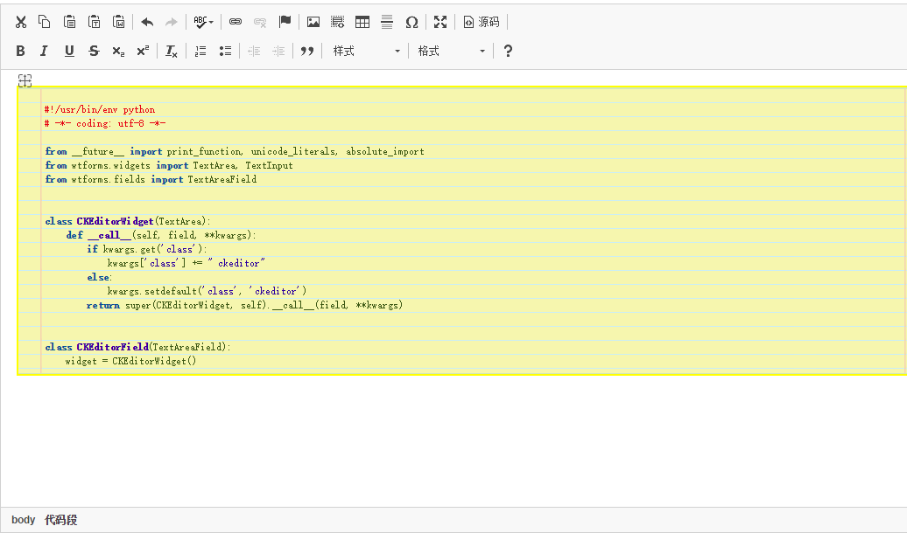

## 概述   
搭建在[VPS](https://www.digitalocean.com/?refcode=ac2fc898c812)上的个人博客，分为两部分：博客和微信公众号后台。

 

## 鸣谢  
博客 [peggyzwy](https://github.com/PeggyZWY/blog-with-flask)  
微信 [广科小猫](https://github.com/paicha/gxgk-wechat-server)
[doraemonext](https://github.com/doraemonext/wechat-python-sdk)  

## 参考资料
https://www3.ntu.edu.sg/home/ehchua/programming/webprogramming/Python3_Flask.html

## 许可协议
[MIT](LICENSE)